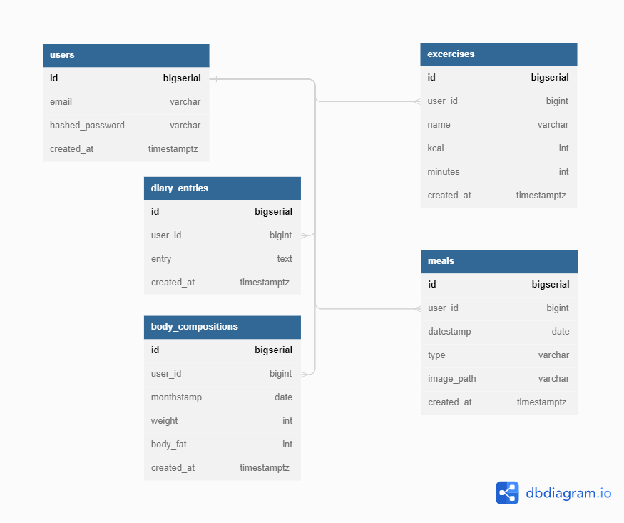

# arent-healthy-app

Fullstack Application for Arent interview

## Introduction

This repo is for the Arent coding test. The purpose of this test is to develop an end-to-end web application that includes the user interface (UI), APIs and database and meets the requirements specified in the [requirements document](/docs/FullstackTest.pdf).

## Architecture

The architecture of the application is described as below:

- UI (Reactjs + TS, Vite) is the user interface of the application.
- Server (Golang, Gin, SQLC) provides APIs to the UI.
- Database (PostgreSQL) stores the information of the users and their data.
- Nginx is used as a reverse proxy to serve the UI and the APIs.
- Docker Compose is used to orchestrate the application.
- ECS and CloudFormation is used to deploy the application.

## ERD and Queries

The database schema is described in this [file](backend/db/migration/000001_init_schema.up.sql) or in the below image:

The queries are written in this [folder](backend/db/query)

## Results

The results is described in this [file](docs/results.md).

## Deployment Status

- The app is deployable on AWS ECS using CloudFormation.
- You can ask me to deploy the app for you, I will give you the ELB link after a while.
- Or you can deploy it using the CloudFormation template in this [file](aws/arent-health-cloudformation-before-first-deploy.yml).
- The `after-first-deploy` template is used after the first deployment to update the ECS service (only to persist the data stored on EFS), and it is located in this [file](aws/arent-health-cloudformation-after-first-deploy.yml).

## How to run the app locally

- Install Docker and Docker Compose.
- Clone the repo.
- Run `docker-compose up` in the root directory of the repo.
- The app will be available on `http://localhost`.

## Needing Improvements

### Frontend

- Bad CSS styling, should use SCSS to reuse the styles.
- No login page, the user is logged in automatically every page change (I know, it's bad).
- Token is stored in the local storage, it should be stored in the cookie.
- No logout page, the user is logged out automatically after 1 hour.
- No error handling, the user is redirected to the homepage if an error occurs.
- No state management, the data is fetched every time the user navigates to a page.
- No loading indicator.
- Basic unit tests.
- (Updated) It seems that the graph is reversed.

### Backend

- Environment variables are public, they should be stored in AWS Secrets Manager.
- Not a full CRUD API, only the `GET` methods are implemented.
- Basic unit tests.

### Deployment

- The deployment is not automated, it should be automated using Github Actions.
- Environment variables are public, they should be stored in AWS Secrets Manager.
- The database is persistent on EFS, but it is using EC2, it should be using RDS.
- All the resources are not using SSL, they should be using Let'sEncrypt.
- No true domain name, URL is using the ELB link.

## Estimated Time

You can use git-hours to see the estimated time, it should say over 24 hours, but it is less than that, I was playing games and watching movies while opening VSCode. It is around 18 hours.

## Conclusion

This is my first time using Docker Compose and Nginx to deploy the app on ECS. I learned a lot from this test, and I really thank you for the opportunity.
